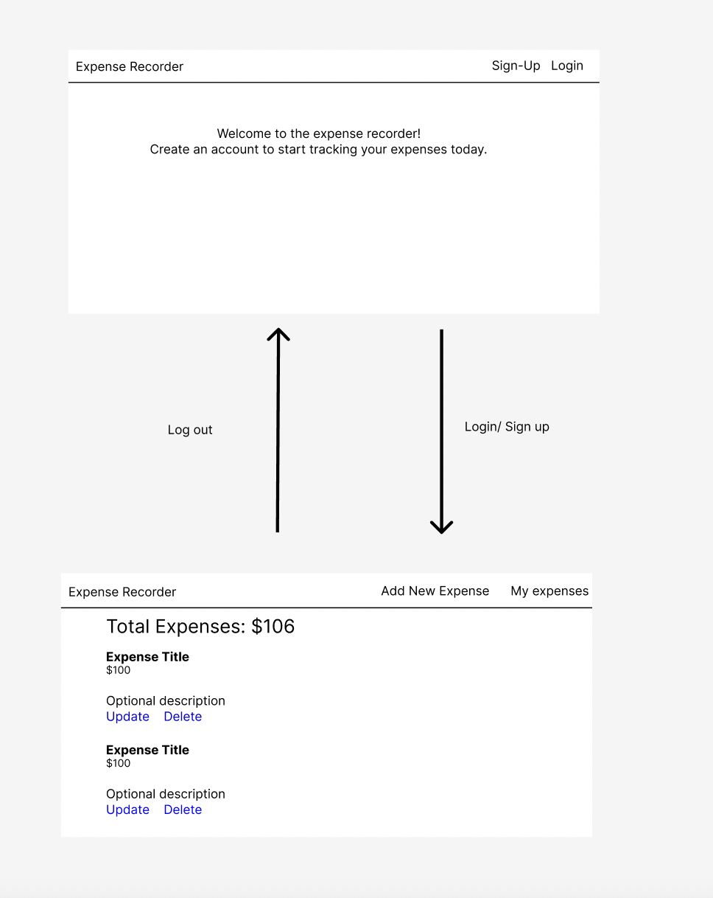

# Expense Recorder 

## Description
This is an app that you can use to track your expenses. 
You can sign in and create an account, then start logging your expenses.

The app can be viewed at https://steph-kimm.github.io/expense_recorder/

- The backend was created by me using express. Its documentation can be found at https://github.com/steph-kimm/expense_recorder_api

## User stories 

Auth:
As a user I want to be able to create an account.
As a user I want to be able to log into my account.
As a user I want to be able to log out of my account.

App:
As a user I want to be able to add new spendings to my list.
As a user I want to be able to see all my past expenses.
As a user I want to be able to edit an expense. 
As a user I want to be able to delete and expense.
As a user I want to be able to see my total spendings.

## Installation

Before you can run the app with `npm start`, install the dependencies: Node.js and npm on your computer. 

[Documentation on downloading and installing Node.js and npm](https://docs.npmjs.com/downloading-and-installing-node-js-and-npm).
To begin, navigate on the project directory (after you have downloaded or cloned this repository) and run:

##### `npm install`

- Then, while in the project directory, you can run:

##### `npm start`

## Development
1. Before coding I made this wireframe to guide my styling while coding
 

## Future improvements

- In the future I would like to add a filter method so that users can filter by date. 

### Routes

| Endpoint         | Component | `AuthenticatedRoute`? |
|------------------|-------------------|-------|
| `/sign-up`       | `SignUp`    | No |
| `/sign-in`       | `SignIn`    | No |
| `/change-password` | `ChangePassword`  | Yes |
| `/sign-out`        | `SignOut`   | Yes |
 